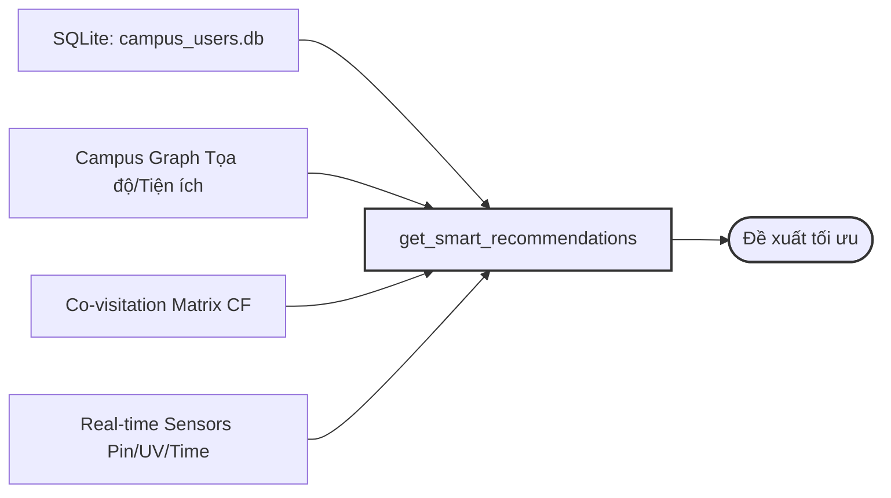

# AI-Powered AR Campus Smart Recommendation & Navigation System

Hệ thống hỗ trợ điều hướng thông minh và gợi ý địa điểm trong khuôn viên trường học ứng dụng trí tuệ nhân tạo (AI) và trải nghiệm thực tế ảo tăng cường (AR Simulation). Dự án kết hợp các mô hình Deep Learning (PyTorch), Thuật toán đồ thị và Xử lý ngôn ngữ tự nhiên để tối ưu hóa trải nghiệm di chuyển của sinh viên và giảng viên.

---

## 1. Cơ Chế Hoạt Động Của Chức Năng Gợi Ý Thông Qua AI (AI Suggestions)

Hệ thống sử dụng cơ chế đề xuất đa nguồn (**Multi-source Fusion**) thông qua hàm `get_smart_recommendations` trong cấu phần `recommender.py` để tính toán điểm số ưu tiên cho từng địa điểm dựa trên 5 bộ lọc chính:

### 🎯 Semantic Matching (Khớp ngữ nghĩa)
* Sử dụng thuật toán **TF-IDF** để phân tích câu hỏi hoặc nhu cầu bằng ngôn ngữ tự nhiên của sinh viên.
* Tính toán độ tương đồng giữa truy vấn với thông tin các dịch vụ, sự kiện, hoặc tên viết tắt/tên thay thế của các tòa nhà.

### 🕒 Contextual Boost (Tối ưu hóa theo ngữ cảnh)
* **Thời gian:** Tự động tăng điểm ưu tiên cho các dịch vụ ăn uống/căn tin (buổi sáng/trưa) hoặc khu vực nhà xe (chiều tối).
* **Thời tiết:** Khi có mưa hoặc nắng gắt, hệ thống kích hoạt *Indoor Boost*, ưu tiên các khu vực trong nhà và các lộ trình di chuyển có mái che.
* **Sức khỏe thiết bị & Môi trường:** * Nếu pin điện thoại yếu ($<20\%$), hệ thống ưu tiên gợi ý tòa nhà có không gian làm việc và ổ cắm sạc.
  * Nếu chỉ số UV cao, ưu tiên các tuyến đường tránh nắng hoặc các khu vực phức hợp trong nhà.

### 👤 Personalization (Cá nhân hóa)
* Điểm số được điều chỉnh dựa trên thuộc tính thực thể của tài khoản: **Vai trò** (Sinh viên / Giảng viên / Khách), **Phong cách học tập**, và **Lịch sử di chuyển** (Ưu tiên các địa điểm có tần suất ghé thăm cao).

### 👥 Item-Item Collaborative Filtering (Lọc cộng tác)
* Phân tích hành vi chung của tập thể dựa trên ma trận đồng xuất hiện (**Co-visitation matrix**).
* *Ví dụ:* Nếu số đông sinh viên thường ghé thăm Địa điểm A rồi tiếp tục di chuyển đến Địa điểm B, hệ thống sẽ tự động đề xuất Địa điểm B cho những người dùng vừa Check-in tại A.

### 🎲 Gumbel-Softmax & $\epsilon$-Greedy Re-ranking
* **Gumbel-Softmax:** Áp dụng kỹ thuật ngẫu nhiên hóa phân phối để xáo trộn nhẹ thứ tự xếp hạng thô, tránh hiện tượng gợi ý lặp khuôn trùng lặp.
* **$\epsilon$-Greedy:** Trích xuất một tỷ lệ nhỏ ($\epsilon$) để đề xuất các địa điểm hoàn toàn mới nhằm tăng tính khám phá ngẫu nhiên (**Serendipity**). Kết quả hiển thị được chia làm 2 nhóm rõ rệt: **Familiar** (Quen thuộc) và **Discovery** (Khám phá).

---

## 2. Kiến Trúc Nguồn Dữ Liệu

Hệ thống hợp nhất dữ liệu từ 4 nguồn chính để đảm bảo tính chính xác và thời gian thực của các quyết định gợi ý:

* **Hồ sơ người dùng cá nhân (`campus_users.db`):** Cơ sở dữ liệu SQLite lưu trữ trường dữ liệu bền vững gồm lịch sử di chuyển (`visited_history`), sở thích (`interests`), vai trò (`role`), đánh giá sao (`ratings`), danh sách yêu thích (`likes`) và đã lưu (`saves`).
* **Thông tin chi tiết về Địa điểm (Campus Graph):** Các thuộc tính cấu trúc tĩnh và động bao gồm: Tiện ích nội khu (điều hòa, ổ cắm, mức độ tiếng ồn, sức chứa), trạng thái đóng/mở cửa, sự kiện đang diễn ra và tọa độ GPS thực tế.
* **Dữ liệu Cộng đồng (Collaborative Filtering):** Tập hợp các phiên (session) di chuyển của toàn bộ sinh viên trong trường để huấn luyện ma trận liên kết nhằm phục vụ mô hình Item-Item CF.
* **Cảm biến & Môi trường thời gian thực:** Thu thập các chỉ số phần cứng (trạng thái pin) và môi trường bên ngoài (nhiệt độ, chỉ số UV, mốc giờ hiện tại, lịch học kế tiếp của sinh viên).

---

## 3. Giao Diện Trải Nghiệm AR (Campus Lens)

**Campus Lens** là giao diện mô phỏng trải nghiệm Thực tế ảo tăng cường (AR) được tối ưu hóa theo ngôn ngữ thiết kế dạng thẻ vuốt dọc (TikTok-like Feed):

* **Nhận diện Vị trí & Phản chiếu AR:** Hệ thống bắt (snap) vị trí GPS hiện tại và tính toán góc hướng (**Bearing**) cùng khoảng cách hình học đến các tòa nhà xung quanh. Các vị trí này hiển thị dưới dạng các thẻ nổi trực quan (**AR Markers**) đè lên luồng camera thực tế.
* **Đồng bộ TikTok-like Feed:** Người dùng vuốt dọc để khám phá các địa điểm xung quanh. Mỗi thẻ hiển thị cụ thể phần trăm độ phù hợp (**Match Score %**) được tính toán từ công cụ AI. Người dùng có thể thả tim, lưu bài viết, xem bình luận hoặc đánh giá trực tiếp từ 1-5 sao để cập nhật tức thì vào trọng số của mô hình AI.
* **Video lộ trình thực tế:** Tích hợp tính năng phát video định vị (Ví dụ: `Toa_D.MOV`) hiển thị góc nhìn thực tế (First-person view) trên tuyến đường dẫn đến tòa nhà đích, hỗ trợ định hình phương hướng trực quan nhất.

---

## 4. Các Mô Hình Học Sâu PyTorch Trong Hệ Thống

Hệ thống triển khai **3 mô hình PyTorch độc lập** đảm nhận các tác vụ tính toán chuyên biệt tại Back-end:

| Tên Mô Hình | Kiến Trúc Core | Vị trí Source | Vai trò & Chức năng |
| :--- | :--- | :--- | :--- |
| **CampusGNN** | Graph Attention Network (`GATConv`) | `engine/gnn_engine.py` | Tiếp nhận cấu trúc đồ thị khuôn viên (Nodes & Edges) và các đặc trưng tòa nhà. Sử dụng cơ chế chú ý đồ thị để gán trọng số ưu tiên (`edge attention`) cho từng đoạn đường, giúp thuật toán tìm đường $A^*$ điều chỉnh chi phí di chuyển (`edge cost`) linh hoạt theo điều kiện thực tế (độ đông đúc, mái che). |
| **IntentClassifier** | Multi-Layer Perceptron (MLP) | `engine/nlp_processor.py` | Chuyển đổi câu truy vấn tự nhiên của người dùng thành vector tần suất từ (**Bag of Words**), đi qua mạng nơ-ron 3 lớp tuyến tính để phân loại chính xác 1 trong 5 ý định cốt lõi: `route_search`, `search_empty_lab`, `search_food_low_crowd`, `event_recommend`, hoặc `general_chat`. |
| **CrowdPredictor** | MLP + Batch Normalization | `engine/recommender.py` | Tiếp nhận vector đầu vào kết hợp (One-hot địa điểm, mốc giờ, thứ trong tuần, tháng, trạng thái mùa thi, thời tiết). Mô hình học các đặc trưng phi tuyến để dự báo chỉ số đông đúc theo thời gian thực (giá trị liên tục từ $0.0 \rightarrow 1.0$), giúp người dùng chủ động tránh các khung giờ quá tải tại Căn tin hoặc Thư viện. |

---

## 5. Hướng Dẫn Cài Đặt & Khởi Chạy

*(Cập nhật các bước cài đặt môi trường và lệnh chạy các file engine tương ứng tại đây)*
